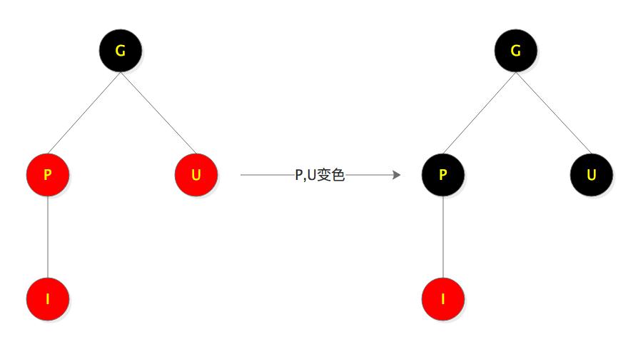
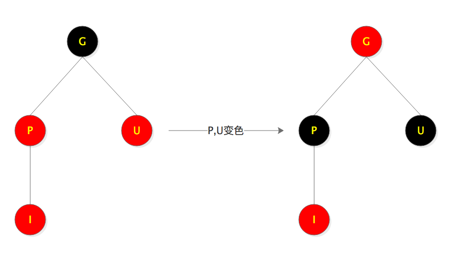
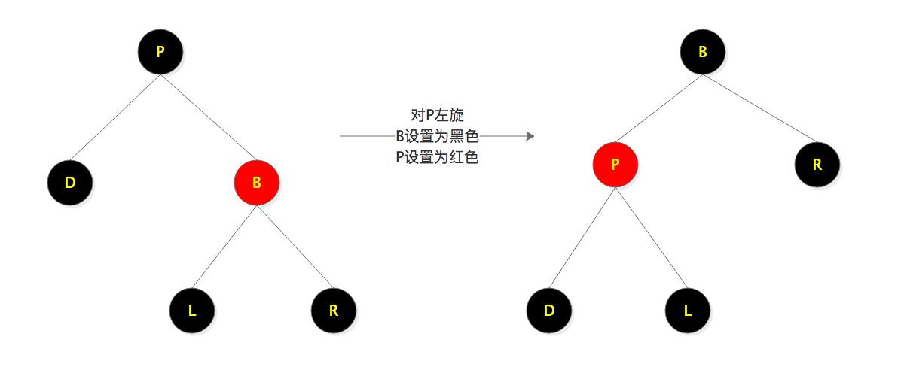
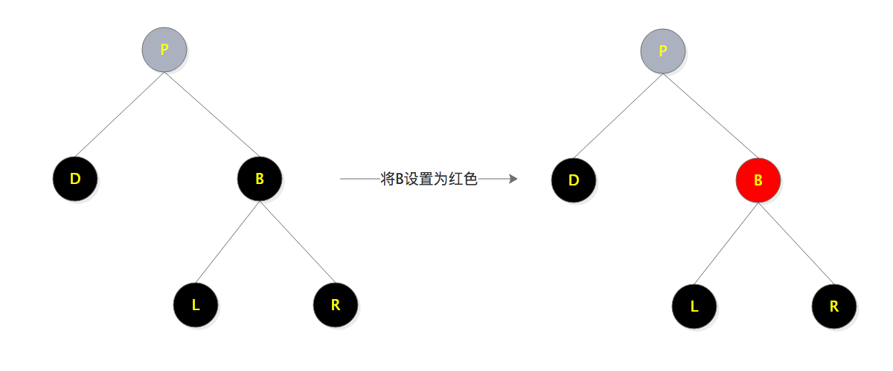
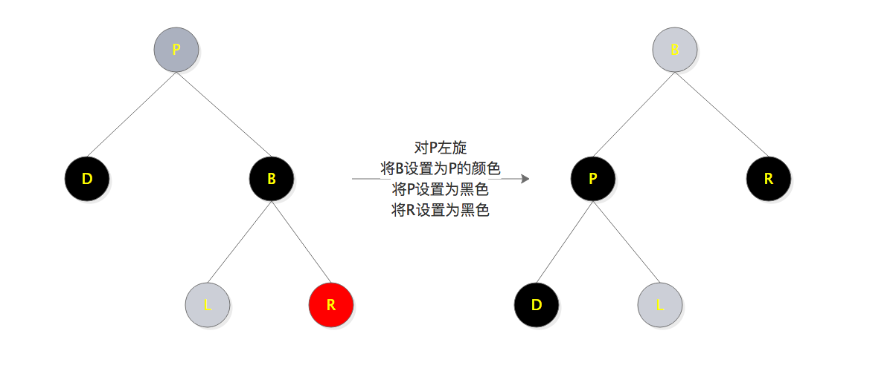
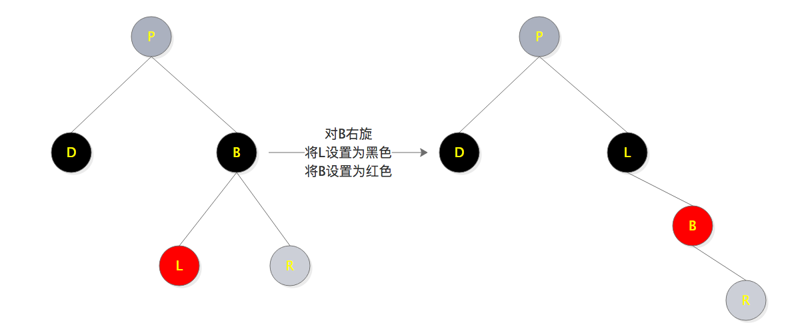

# 红黑树

## 特征

1. 节点是红色或黑色
2. 根节点是黑色
3. 所有叶子(nil)都是黑色
4. 红色节点的子节点都是黑色
5. 从任一节点到其每个叶子的所有路径都包含相同数目的黑色节点

## 左旋

将A的右节点变为A的父节点，并将旋转之前A的右节点的左子树变为旋转后的A的右子树

## 右旋

将A的左节点变为A的父节点，并将旋转之前A的左节点的右子树变为旋转后的A的左子树

## 插入

插入节点默认为红色

1. 先将红黑树的插入视为二叉树的插入。找到父节点，将插入节点作为父节点的左节点或右节点
2. 判断父节点颜色，若父节点为黑色，无需平衡；若父节点为红色，通过变色或旋转使树平衡(满足红黑树的特征)

#### 插入流程

1. 树为空，将插入节点设置为根节点，并设置为黑色，退出
2. 树不为空，找到插入节点的父节点
3. 父节点与插入节点相等，退出
4. 父节点与插入节点不等，将插入节点作为左节点或右节点
5. 父节点为黑色，退出
6. 父节点为红色，通过变色或旋转使红黑树平衡

## 插入平衡

字母描述：

+ P:Parent 父节点
+ I:Insert 插入节点
+ G:Grandpa 祖父节点
+ U:Uncle 叔叔节点

1. S1:叔叔节点为红色
    - 1.1 祖父节点是根节点

    

    - 1.2 祖父节点不是根节点

    

    将G节点视为新的“插入”节点向上继续平衡

    从S2开始叔叔节点为空或者为黑色

2. S2: 父节点为左节点
    - 2.1 插入节点为左节点

    

    - 2.2 插入节点为右节点

    

3. S3: 父节点为右节点
    - 3.1 插入节点为右节点
    
    

    - 3.2 插入节点为左节点

    

## 删除

1. 先将红黑树的删除视为二叉树的删除。二叉树的删除有三种情况
    - 1.1 删除节点D没有子节点，直接删除D
    - 1.2 删除节点D有一个子节点S，将D删除，并将S移动到D的位置
    - 1.3 删除节点D有两个子节点，找到D的后继节点N(右子树的最左子节点),把N节点删除后，将N节点的值赋值到D节点
    
    删除操作最终都会转化为1.1和1.2两种情况
    
2. 判断删除节点的颜色，若删除节点为红色，无需平衡；若删除节点为黑色，通过变色或旋转使树平衡(满足红黑树的特征)

## 删除平衡

1. 删除场景1.2的颜色平衡，删除节点只有一个子节点，删除D，将子节点放到D的位置，并将子节点设置为黑色
2. 删除场景1.1的颜色平衡
    - 2.1  删除节点为左节点
        - 2.1.1 兄弟节点为红色，2、3、4兄弟节点都为黑色

        
         &emsp;&emsp;&emsp;&emsp;&emsp;&emsp;&emsp;&emsp;&emsp;&emsp;&emsp;&emsp;&emsp;&emsp;&emsp;场景2.1.1转为了场景2.1.2
    
        - 2.1.2 兄弟节点没有子节点或子节点都为黑色
        
        

            D是被删除的节点，PD路径上会少一个黑节点，为了使PB路径平衡，将B设置为红色，以P为根节点的树会少一层黑色
            若P为红色，将P设置为黑色，整颗树平衡；若P为黑色，并将P作为删除节点继续向上平衡，直到当删除节点为根节点时退出。目的是向上一直递归，将根节点的左子节点或右子节点变为红色，使整颗树平衡
        - 2.1.3 兄弟节点有右孩子节点且为红色
        
        

            D是被删除节点，这种情况下可以向兄弟节点借节点过来占据原来节点的位置，并设置成原来节点的颜色使树平衡，

        - 2.1.4 兄弟节点有左孩子节点且为红色

        
         &emsp;&emsp;&emsp;&emsp;&emsp;&emsp;&emsp;&emsp;&emsp;&emsp;&emsp;&emsp;&emsp;&emsp;&emsp;场景2.1.4转为了场景2.1.3

    - 2.2  删除节点为右节点，与2.1进行对称的操作

