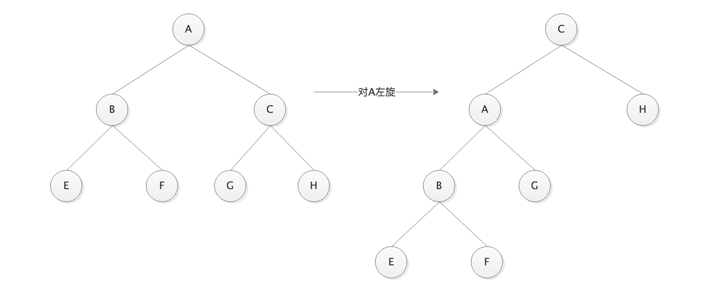
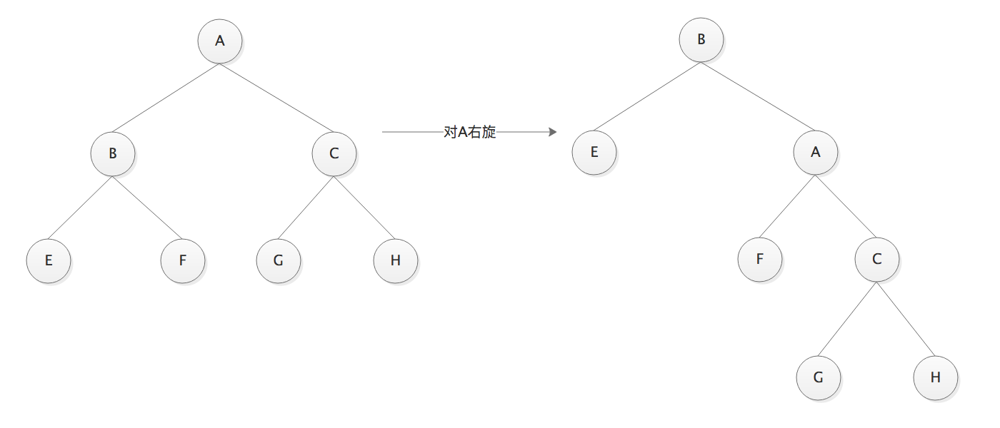
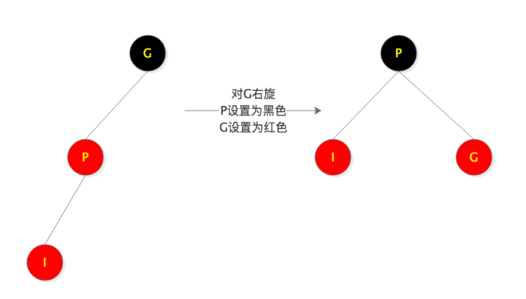
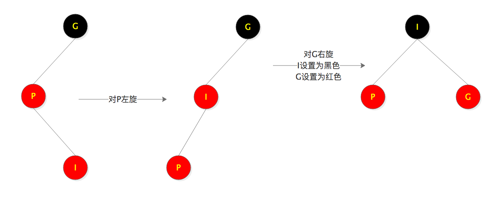
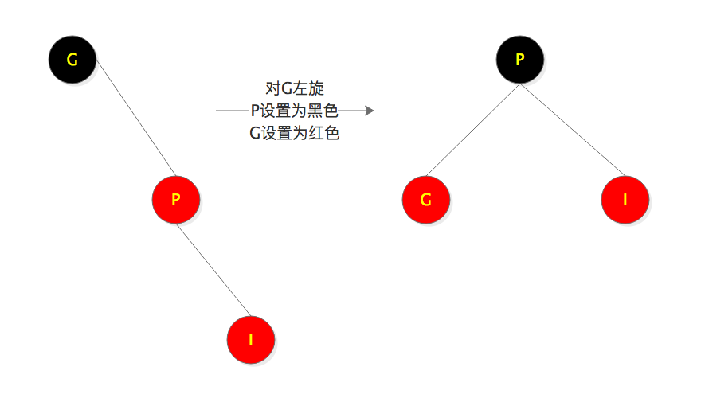
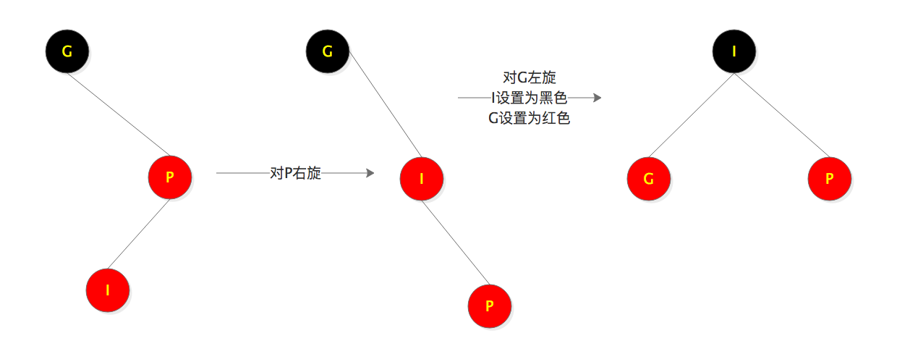

# 红黑树

## 特征
1. 节点是红色或黑色
2. 根节点是黑色
3. 所有叶子(nil)都是黑色
4. 红色节点的子节点都是黑色
5. 从任一节点到其每个叶子的所有路径都包含相同数目的黑色节点

## 左旋

将A的右节点变为A的父节点，并将旋转之前A的右节点的左子树变为旋转后的A的右子树

## 右旋

将A的左节点变为A的父节点，并将旋转之前A的左节点的右子树变为旋转后的A的左子树

## 插入
    插入节点默认为红色
#### 思路
    1. 先将红黑树的插入视为二叉树的插入，找到父节点，将插入节点作为父节点的左节点或右节点
    2. 判断父节点颜色，若父节点为红色，通过变色或旋转使树平衡(满足红黑树的特征)

#### 插入流程
    1. 树为空，将插入节点设置为根节点，并设置为黑色，退出
    2. 树不为空，找到插入节点的父节点
    3. 父节点与插入节点相等，退出
    4. 父节点与插入节点不等，将插入节点作为左节点或右节点
    5. 父节点为黑色，退出
    6. 父节点为红色，通过变色或旋转使红黑树平衡
#### 第6步的5种细分场景

字母描述：

+ Root 根节点
+ P:Parent 父节点
+ Left 左节点
+ Right 右节点
+ Red 红色
+ Blace 黑色
+ I:Insert 插入节点
+ U:Uncle 叔叔节点
+ G:Grandpa 祖父节点
+ rotateToRight(A) 对A右旋
+ rotateToLeft(A)  对A左旋 

1.  S1: 叔叔节点不为空且为红色

    将父节点和叔叔节点设置为黑色。如果祖父节点不是根节点，将祖父节点设置为红色，并将祖父节点视为插入节点向上继续平衡，这里将祖父视为插入节点只是为了向上平衡，而不是真正的插入，真正的插入已经在策略1中完成了

    从S2开始叔叔节点为空或者为黑色

2. S2: 父节点为左节点

    S2.1 插入节点为左节点

    

    S2.2 插入节点为右节点

    

3. S3: 父节点为右节点

    S3.1 插入节点为右节点
    
    

    S3.2 插入节点为左节点

    

## 删除

#### 思路
1. 先将红黑树的删除视为二叉树的删除
2. 判断删除节点的颜色，若删除节点为黑色，通过变色或旋转使树平衡(满足红黑树的特征)

#### 删除流程
1. 树为空，退出
2. 查找删除节点D，未找到，退出
3. 删除节点没有子节点
   3.1 删除节点为根节点，将树置空，退出
   3.2 删除节点不为根节点，删除D,进入平衡流程6
4. 删除节点只有一个子节点，删除D，将子节点放到D的位置，并将子节点设置为黑色。此时D一定黑色，子节点一定为红色。反证法--假设删除节点为红色，那么必须存在两个黑色节点树才平衡，假设不成立
5. 删除节点D有两个子节点，找到后继节点N(右子树的最左子节点)，继续进行第3步或第4步，并将N节点的值赋值给D节点
6. 通过变色或旋转使红黑树平衡

最终的删除流程都会变成步骤3.2

#### 第6步的9种细分场景
1. 删除节点为红色，退出
2. 删除节点为左节点
    2.1 兄弟节点为红色，下列情况兄弟节点为黑色
    2.2 兄弟节点没有子节点或子节点都为黑色
    2.3 兄弟节点有右孩子节点且为红色
    2.4 兄弟节点有左孩子节点且为红色
3. 删除节点为右节点
    3.1 兄弟节点为红色，下列情况兄弟节点为黑色
    3.2 兄弟节点没有子节点或子节点都为黑色
    3.3 兄弟节点有左孩子节点且为红色
    3.4 兄弟节点有右孩子节点且为红色

## 插入旋转与删除旋转变色总结
